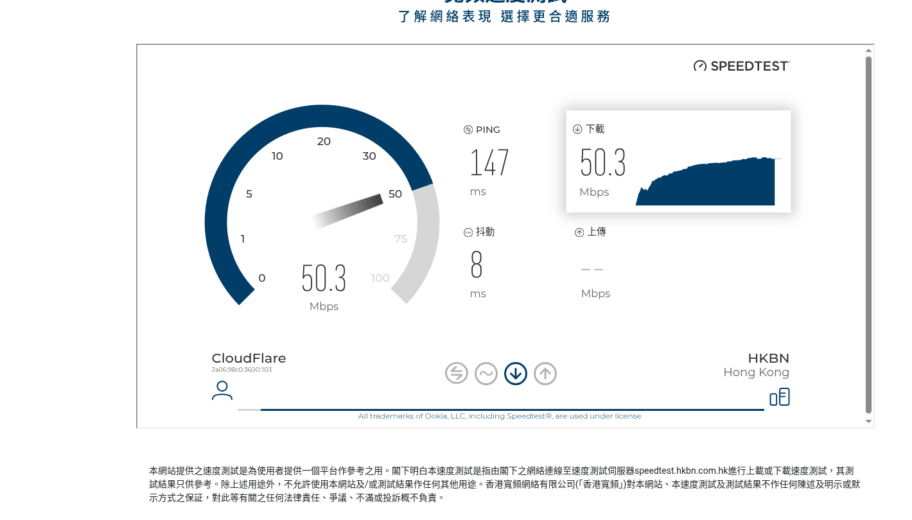
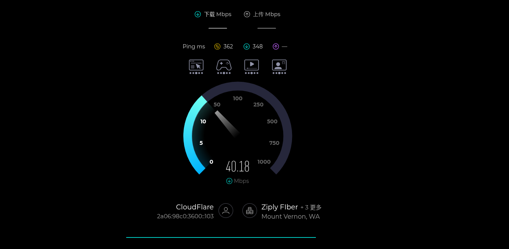
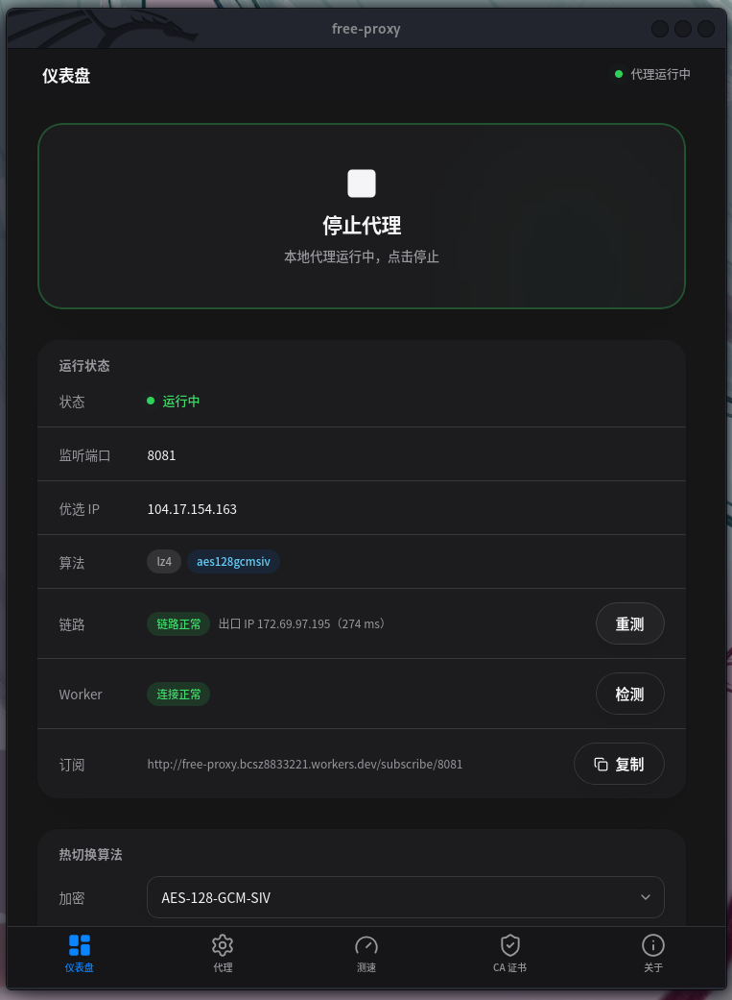
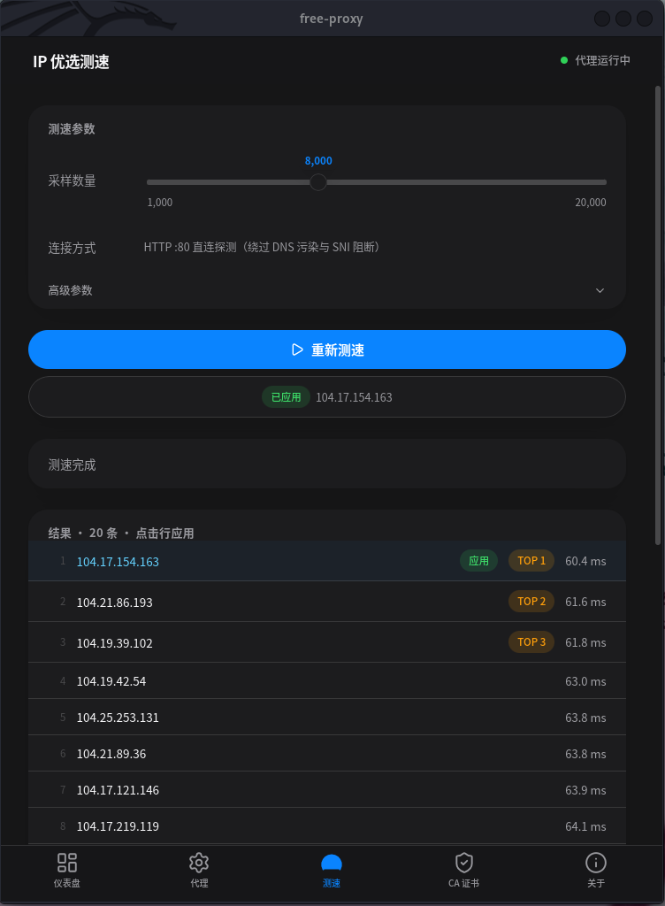

# free-proxy — 零成本私人独享代理

> 不用买 VPS、不用买域名、不用备案，只用 **Cloudflare 免费的 Worker**，就能部署一个私人且几乎无限流量的代理节点。

---

## 一、这是什么？

`free-proxy` 是一个「客户端 + 免费中转服务」组成的私人代理方案：

- **服务端**跑在 Cloudflare Worker 上——这是 Cloudflare 的**免费**服务，按免费额度提供日常请求量，个人上网绰绰有余；
- **客户端**是桌面 / 手机上的一个小应用，负责加密、压缩、加速，并把流量交给你的 Worker 转发。

<div></div>
<div></div>

### 它能给你带来什么

- **免费**：全部依赖 Cloudflare 免费额度，零月租、零维护成本；
- **独享**：节点只属于你，认证密钥只在你和设备两端；
- **省流量**：内置压缩（zstd / lz4），相同内容传得少、跑得快；
- **更安全**：多种加密算法可选（ChaCha20-Poly1305 / Ascon-AEAD128 等），传输内容被加密；
- **自动挑最快的路**：内置「优选 IP」测速工具，帮你找到与 Worker 之间最快的网络路径；
- **全家桶通用**：客户端可一键导出订阅链接，Clash / sing-box / v2rayN 等工具都能用；
- **WebSocket支持**：内置 WebSocket 隧道，聊天 / 推送 / 在线协作等基于 `ws://` / `wss://` 的应用同样走加密代理；
- **跨平台**：桌面（Windows / macOS / Linux）+ 手机（Android和iOS 实验性支持）。

---

## 二、你需要准备什么

1. 一个 **Cloudflare 账号**（免费注册）；
2. 一台**电脑**。
3. 电脑上装好：**Node.js**、**Rust 工具链**、**pnpm**。


---

## 三、快速上手

### 第 1 步：部署你的免费 Worker

```bash
# 安装构建工具（只需一次）
cargo install -q "worker-build@^0.8"

# 部署到 Cloudflare（首次会让你登录并选择账号）
cd server-rs
wrangler deploy
```

部署完成后，给 Worker 配置两个密钥（在 Cloudflare 控制台对应 Worker 的「设置 → 变量」里添加，或命令行执行）：

| 密钥       | 填什么          | 说明                                            |
|----------|--------------|-----------------------------------------------|
| `key`    | 你自己随便编一串字符   | 认证密钥，**请记好**，客户端要用同一个                         |
| `domain` | 你的 Worker 域名 | 形如 `free-proxy.xxxx.workers.dev`，**注意不要带端口号** |

### 第 2 步：启动客户端

```bash
cd client_tauri
pnpm tauri build   # 桌面端（Windows / macOS / Linux）
# 然后安装运行构建的程序
```

打开应用后，进入「代理」页填写：

- **域名**：和上面 `domain` 一致（如 `free-proxy.xxxx.workers.dev`）；
- **认证密钥**：和上面 `key` 一致；
- **协议**：默认 HTTP 即可（走 HTTPS 一般没必要）；
- **本地端口**：默认 `8081`；
- **算法**：一般默认即可。

回到「仪表盘」，点击**启动代理**，等待「链路正常」+ 显示出口 IP


### 第 3 步：导入订阅或设置代理
- 复制仪表板中的订阅链接，使用你你的代理客户端（如clash,v2rayN）导入。
- 或者在系统或浏览器（通过FoxyProxy或类似插件）直接设置http代理。

### 第 4 步：信任 CA 证书（访问 HTTPS 网站必需）

客户端要能解密 HTTPS，需要把应用生成的本地证书信任为系统根证书：

- 打开客户端的「CA 证书安装」页，点击**一键安装**；
- **Linux 用户**需要先安装 `certutil`，各发行版命令：

```bash
# Debian / Ubuntu
sudo apt install libnss3-tools
# Fedora / RHEL
sudo dnf install nss-tools
# Arch Linux
sudo pacman -S nss
```

> 该证书由你的设备本地生成并加密保存，只影响你自己的设备；换设备需重新导入。

---

## 四、优选 IP


在「IP 优选测速」页点击开始，应用会自动对一批候选 IP 做两轮测速（连通性 + Worker 健康检查），并给出最优结果。把最优 IP 填进「代理」页的**优选 IP** 栏（或直接一键应用），下次启动即生效——网络不好时这一步往往立竿见影。

> 优选ip时请关闭tun或其他代理，否则将导致优选失败

---

## 五、常见问题（FAQ）

**为什么连不上 / 无法上网？**
按顺序排查：① 域名和密钥是否与 Worker 一致；② 本地端口是否被占用；③ HTTPS 站点是否已信任 CA 证书；④ 「验证 Worker」是否提示连接正常。

**免费额度够用吗？**
Cloudflare Workers 免费版每天提供约 10 万次请求额度，个人日常浏览、看网页、刷社交足够。大流量下载请留意用量，超限会暂停当天服务，次日自动恢复。

**为什么有的网站打不开？**
部分站点对代理访问有限制，属正常现象；另外可尝试切换「优选 IP」或更换算法组合。

**大文件上传总是失败 / 很慢？**
本地客户端与 Worker 对请求体做流式加解密，Cloudflare 免费版每个请求的 CPU 时间有限，超大请求体的累计解密/解压开销可能触顶导致传输中断。建议先压缩文件再上传，或升级 Workers Paid 提升上限。

**为什么首次启动链路异常？**
需要去「IP 优选测速」页点测速选择一个ip，否则无优选ip会回退到DNS解析，将导致获得受DNS污染的ip或tls握手时受到sni阻断。

**在哪里看日志 / 怎么开启 debug 日志？**
客户端统一使用 `lib/log` 日志（`RUST_LOG` 控制等级与过滤，如 `RUST_LOG=debug`）。GUI 日志写入应用数据目录的 `logs/freeproxy.log`（1MB 轮转，ANSI 关闭）；命令行客户端输出到终端 stderr（带颜色）。Worker 端日志打印到控制台。

---

## 六、工作原理

### 普通Http请求

普通 HTTP 请求走 `/api/{version}/{target}` 转发。

```
浏览器
  │  （HTTP/HTTPS 明文交给本地客户端）
  ▼
本地客户端 ── 压缩 + 加密 ──▶ 免费 Worker ──▶ 目标网站
  ▲                                    │
  └────────── 加密返回 ────────────────┘
```

- 浏览器把流量交给本地客户端；
- 客户端**压缩 + 加密**后，通过Worker转发到目标网站；
- Worker 拿到网站响应，再加密传回客户端解密，写回浏览器；
- 通过http2请求worker。

### WebSocket 隧道

浏览器发起 `ws://` / `wss://` 升级请求时，会自动切换到独立的 WebSocket 隧道（`/ws/{version}/{target}`）：

```
浏览器 ── ws/wss 升级请求 + RFC 6455 帧 ──▶ 本地客户端 ── 加密隧道消息 ──▶ Worker ──▶ 上游 WS 服务器
   ▲                                                                                   │
   └────────── 原始 WS 帧（101 响应头 / 数据帧 / close 帧）零解析回写 ───────────────┘
```

- **本地客户端**负责 RFC 6455 协议细节：帧解析、掩码解掩码、分片重组；浏览器的 Ping 帧本地直接回 Pong，不占用隧道带宽；
- **Worker 端**与上游完成真正的 WebSocket 握手（含按客户端 key 计算 `Sec-WebSocket-Accept`），之后全双工转发，浏览器收到的仍是原始 WS 帧，text / binary / close 语义完整保留；
- **保活**：隧道侧每 60 秒发一次 Ping（低于 Cloudflare 约 100 秒的空闲断开阈值），避免长连接被空闲回收；
- 升级请求必须走 HTTP/1.1（HTTP/2 不支持 Upgrade 语义），客户端连接 Worker 的隧道通道已强制 HTTP/1.1。

### 请求核心
通过worker::Fetch 接口发送请求，而不是worker::Socket，不受限制，可以连接使用了cf服务的站点，能够解锁更多内容。


---

## 附录

### 目录结构

```
free-proxy/
├── package.json                  # 根 npm 脚本（server-dev/deploy, client-dev, test-lib, test-e2e）
├── deny.toml                     # cargo-deny 共享配置（四个 crate 共用）
├── .github/workflows/release.yml # tag 触发的发布 CI（桌面 + CLI + Worker zip）
├── lib/src/                      # 双端共享核心库——编译为 native 和 wasm32 两种目标
│   ├── aead.rs                   #   AEAD 加密：ChaCha20-Poly1305 / Ascon-AEAD128
│   ├── algo.rs                   #   压缩 × 加密组合协商 + URL 契约 /api/{version}/{target}
│   ├── base.rs                   #   base64 编解码
│   ├── client/                   #   仅客户端（feature "client"）：共享客户端逻辑
│   │   ├── mod.rs                #     ProxySettings / IDENTIFIER / DEFAULT_PORT 重导出
│   │   ├── config.rs             #     settings.json 读写（CLI 与 GUI 共享 app_data_dir）
│   │   ├── ca.rs                 #     本地 CA 证书管理
│   │   ├── speed.rs              #     优选 IP 测速编排
│   │   └── subscribe.rs          #     Clash / sing-box / base64 订阅导出
│   ├── compress.rs               #   zstd / lz4 压缩
│   ├── frames.rs                 #   二进制帧流协议：[4B 大端长度 | 负载]，零长帧 = 结束
│   ├── hash.rs                   #   sha1 / sha2 哈希
│   ├── http.rs                   #   httparse 头部解析 + UrlBuilder（零拷贝）
│   ├── kdf.rs                    #   HKDF 密钥派生
│   ├── lib.rs                    #   crate 根：feature 门控重导出 + 日志初始化
│   ├── log.rs                    #   统一日志宏（error!/warn!/info!/debug!/trace!）
│   ├── tool.rs                   #   derive_keys（auth_key+domain）、时间窗令牌认证、XOR 混淆
│   ├── ws.rs                     #   RFC 6455 帧 + WsTunnelMsg（客户端与 Worker 共用）
│   ├── proxy/                    #   仅客户端（feature "client"）：本地 HTTP 代理
│   │   ├── mod.rs                #     ProxyConfig / Shared / 代理生命周期
│   │   ├── connection.rs         #     连接分发（明文 HTTP vs CONNECT）
│   │   ├── body.rs               #     请求体边界解析
│   │   ├── client.rs             #     上游 reqwest 客户端（主/优选IP/WS HTTP1.1）
│   │   ├── tls.rs                #     MITM TLS：自签 CA + 每 SNI 叶子证书（moka 缓存）
│   │   └── core/                 #     转发引擎（serve 循环，EOS 保活）
│   │       ├── mod.rs            #       read_raw / RawRead（read_buf 零拷贝读循环）
│   │       ├── http.rs           #       HTTP 中继：头部帧 → 体泵 → 响应转发
│   │       └── ws.rs             #       WS 隧道客户端侧（RFC6455 解析/掩码/重组；
│   │                             #       上传/下载/写入任务 + ctrl/data 通道）
│   └── speed_test/               #   仅客户端：优选 IP 两阶段测速
│       ├── mod.rs                #     模块入口
│       ├── tcping.rs             #     阶段一：TCP 连接延迟探测
│       ├── health.rs             #     阶段二：Worker /health 检查
│       └── ip.rs                 #     Cloudflare IP 候选区间
├── server-rs/                    # Cloudflare Worker（Rust → wasm32，worker crate + axum）
│   ├── wrangler.toml             # worker 配置；[dev] port=80；勿动 compatibility_flags
│   ├── .dev.vars                 # gitignored 开发密钥（key/domain）
│   └── src/
│       ├── app.rs                #   axum 路由、Bearer 认证中间件（±30s 窗口）、路由表
│       ├── proxy_http.rs         #   POST /api/{version}/{target}：流式解密→请求→再加密
│       ├── proxy_ws.rs           #   GET /ws/{version}/{target}：上游 WS 握手 + 全双工中继
│       ├── subscribe.rs          #   GET /subscribe/{port}：Clash / sing-box / base64 订阅
│       └── lib.rs                #   Worker 入口
├── client_cli/src/               # CLI 客户端：main.rs（clap）、run.rs（代理循环）、speed.rs、
│                                 # health.rs、ca.rs（证书安装）、config.rs（settings.json）
├── client_tauri/                 # Tauri 2 + React 19 客户端（桌面 + Android）
│   ├── src/                      # React 前端：pages/（Dashboard、ProxySettings、SpeedTest、
│   │                             # CaCert、About）、components/{layout,ui}/、store/
│   └── src-tauri/                # Tauri 后端：commands/（proxy、speed、settings）、tray
└── lib_test/                     # E2E 全链路测试（cargo run，非 cargo test）
    └── src/
        ├── main.rs               #   测试入口
        ├── cs.rs                 #   全链路编排（Worker + 代理 + 目标站）
        └── test/                 #   HTTP / HTTPS 可达性与代理测试用例
```

### 开发命令

```bash
# 服务端本地开发（端口 80，密钥读取 server-rs/.dev.vars）
npm run server-dev
# 服务端部署
npm run server-deploy
# 客户端桌面开发
npm run client-dev
# 客户端 Android 开发
npm run client-android-dev
# 共享库单元测试
npm run test-lib
# 端到端集成测试
npm run test-e2e
```

### 安全模型

- 密钥由 `auth_key + domain` 经 Sha256 哈希 + HKDF 派生，客户端与 Worker 两端独立推导出同一组密钥，无需网络传输密钥；
- 每次请求的快速认证令牌由Ascon128 + 时间戳 + nonce 组成，服务端仅接受 ±30 秒内的令牌；
- 本地 CA 私钥使用设备唯一标识 + 随机盐派生密钥加密存储，换设备需重新导入证书。


### 客户端界面

<div></div>
<div></div>

---

## 许可

本项目采用 **MIT OR Apache-2.0** 双许可。

- [MIT License](LICENSE-MIT) — Copyright (c) 2026 ZEROLINGG
- [Apache License 2.0](LICENSE-APACHE) — Copyright 2026 ZEROLINGG

贡献即视为同意以相同双许可分发。

